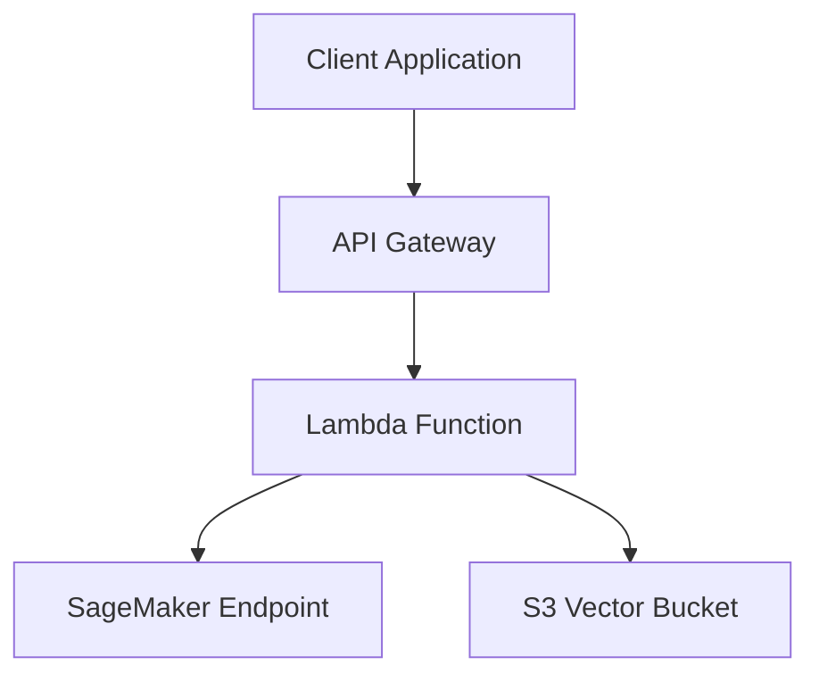
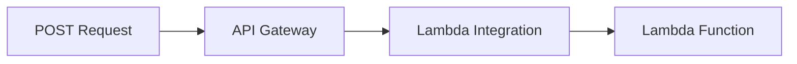
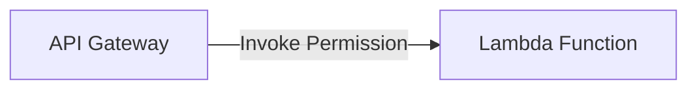
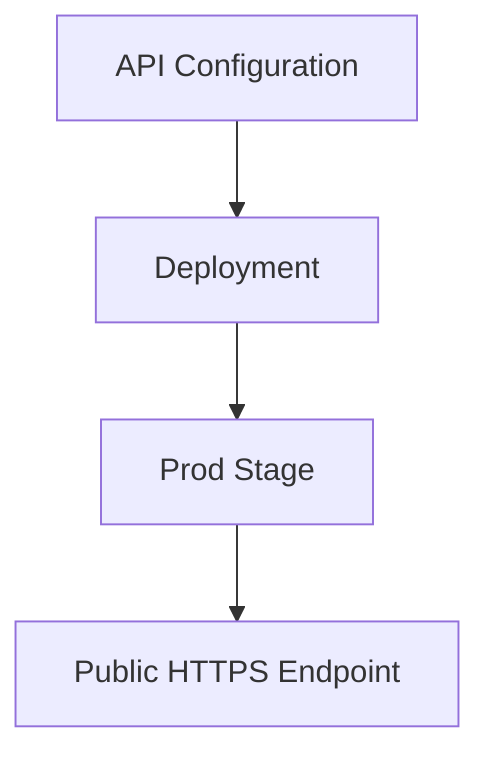
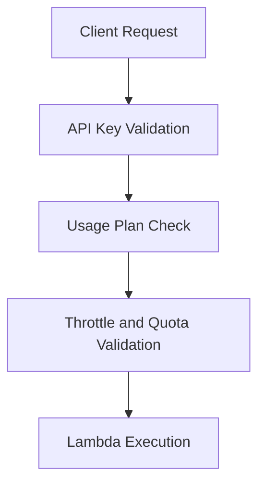
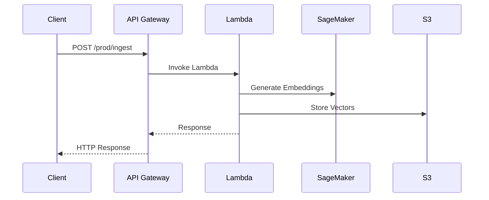

# API Gateway Architecture Summary

## Overall Flow



---

# Main Resources

| Resource                         | Purpose                             |
| -------------------------------- | ----------------------------------- |
| `aws_api_gateway_rest_api`       | Creates the API                     |
| `aws_api_gateway_resource`       | Creates URL path                    |
| `aws_api_gateway_method`         | Defines HTTP method                 |
| `aws_api_gateway_integration`    | Connects API Gateway to Lambda      |
| `aws_lambda_permission`          | Allows API Gateway to invoke Lambda |
| `aws_api_gateway_deployment`     | Publishes API                       |
| `aws_api_gateway_stage`          | Creates environment (`prod`)        |
| `aws_api_gateway_api_key`        | Creates API key                     |
| `aws_api_gateway_usage_plan`     | Adds quotas and throttling          |
| `aws_api_gateway_usage_plan_key` | Connects API key to usage plan      |

---

# 1. REST API

```hcl id="11prlg"
resource "aws_api_gateway_rest_api" "api"
```

Creates the main API container.

Example base URL:

```text id="iqazb7"
https://abc123.execute-api.us-east-1.amazonaws.com
```

---

# 2. API Resource

```hcl id="36ob34"
resource "aws_api_gateway_resource" "ingest"
```

Creates URL path:

```text id="m6flpf"
/ingest
```

---

# 3. API Method

```hcl id="hjqzv7"
resource "aws_api_gateway_method" "ingest_post"
```

Creates endpoint:

```text id="y7ozzk"
POST /ingest
```

---

# API Structure

```mermaid
flowchart TD
    A[REST API] --> B[/ingest Resource]
    B --> C[POST Method]
```

---

# 4. Lambda Integration

```hcl id="v1xzc5"
resource "aws_api_gateway_integration" "lambda"
```

Connects API Gateway to Lambda.

Without this:

* API exists
* But no backend runs

Uses:

```hcl id="zov5jb"
type = "AWS_PROXY"
```

Meaning API Gateway forwards the request directly to Lambda.

---

# Integration Flow



---

# 5. Lambda Permission

```hcl id="r0sz2v"
resource "aws_lambda_permission" "api_gateway"
```

Allows API Gateway to invoke Lambda.

Without this permission:

* API Gateway gets AccessDenied
* Lambda cannot execute

---

# Permission Relationship



---

# 6. API Deployment

```hcl id="e9te2i"
resource "aws_api_gateway_deployment" "api"
```

Publishes API configuration.

API Gateway changes are not live automatically.

Deployment acts like:

```text id="h7v4m8"
Publish current API configuration
```

---

# 7. API Stage

```hcl id="7nd6v0"
resource "aws_api_gateway_stage" "api"
```

Creates environment/stage:

```text id="hbp5bi"
prod
```

Final endpoint:

```text id="q9pjlwm"
https://abc123.execute-api.us-east-1.amazonaws.com/prod/ingest
```

---

# Deployment Flow



---

# 8. API Key

```hcl id="47blwx"
resource "aws_api_gateway_api_key" "api_key"
```

Creates API key for clients.

Clients send:

```http id="3h9j0y"
x-api-key: YOUR_API_KEY
```

Used for:

* access control
* usage tracking
* quotas

---

# 9. Usage Plan

```hcl id="rm9q5r"
resource "aws_api_gateway_usage_plan" "plan"
```

Defines:

* request limits
* throttling
* monthly quotas

Example:

```hcl id="a8t5wm"
limit = 10000
rate_limit = 100
burst_limit = 200
```

---

# 10. Usage Plan Key

```hcl id="g0m4el"
resource "aws_api_gateway_usage_plan_key" "plan_key"
```

Connects:

```text id="jlwmg9"
API Key → Usage Plan
```

---

# API Security Flow



---

# Final Request Lifecycle


