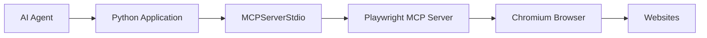
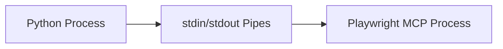
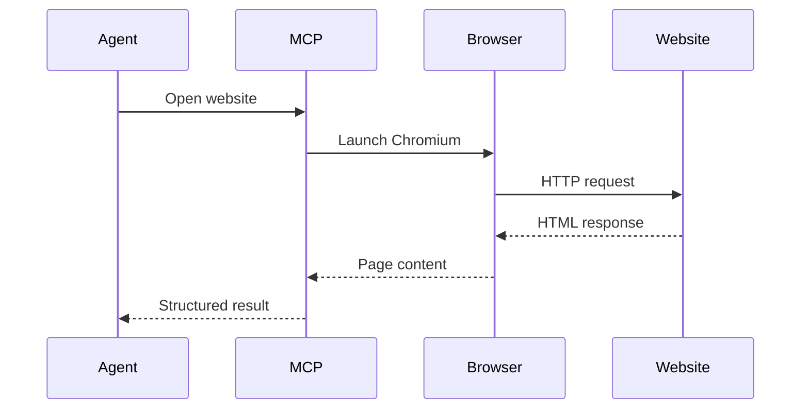
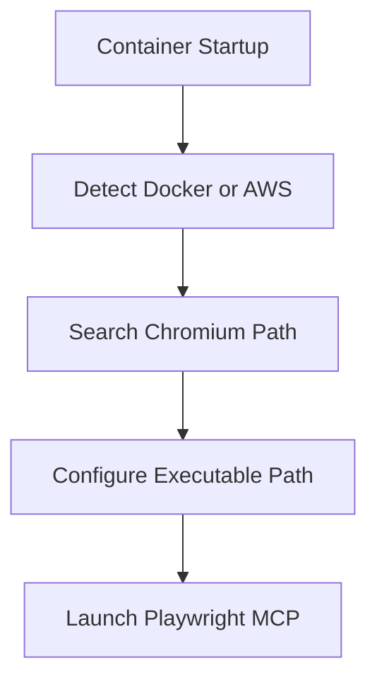
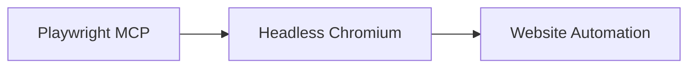
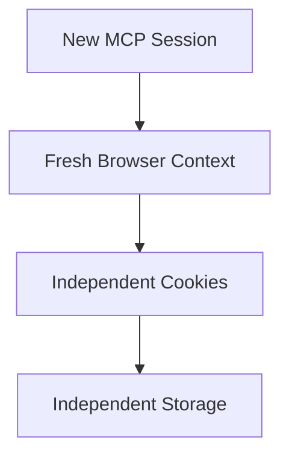
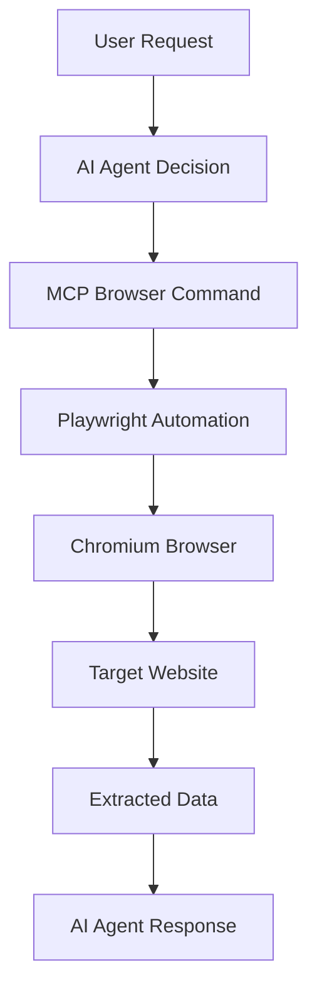

# OpenAI Agents SDK MCP Architecture

This architecture allows an AI agent to control a real browser through an MCP server using Playwright.

The Python application launches a Playwright MCP process using `npx`, and the MCP server manages a Chromium browser instance.

The browser can then:

* open websites
* click buttons
* fill forms
* scrape content
* automate workflows

---

# High-Level Architecture

---

# Component Responsibilities

| Component          | Responsibility                               |
| ------------------ | -------------------------------------------- |
| AI Agent           | Decides browsing actions                     |
| Python Application | Creates and manages MCP server               |
| MCPServerStdio     | Handles process communication                |
| Playwright MCP     | Converts agent requests into browser actions |
| Chromium Browser   | Executes real browser interactions           |
| Websites           | External systems being accessed              |

---

# Process Communication Design

`MCPServerStdio` communicates with the Playwright MCP process using stdin/stdout pipes.

This creates a lightweight local IPC (inter-process communication) architecture.

---

# Browser Automation Flow

The AI agent does not directly control the browser.

Instead:

1. Agent sends instructions
2. MCP server interprets them
3. Playwright executes browser automation
4. Browser interacts with website
5. Results return back to agent

---

# Runtime Architecture in Docker

Inside Docker/AWS environments, the system dynamically discovers the installed Chromium executable path.

This avoids hardcoding browser versions.

---

# Why Headless Mode Is Used

The browser runs in headless mode because this system is designed for:

* servers
* containers
* CI/CD pipelines
* cloud environments

No graphical desktop is required.

---

# Security Isolation Design

The browser runs in isolated mode to prevent session sharing.

Each MCP session gets a clean browser environment.

Benefits:

* no cookie leakage
* no shared sessions
* safer multi-user execution
* reproducible automation

---

# End-to-End Request Lifecycle

