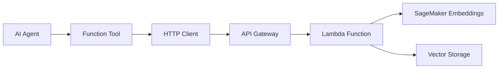
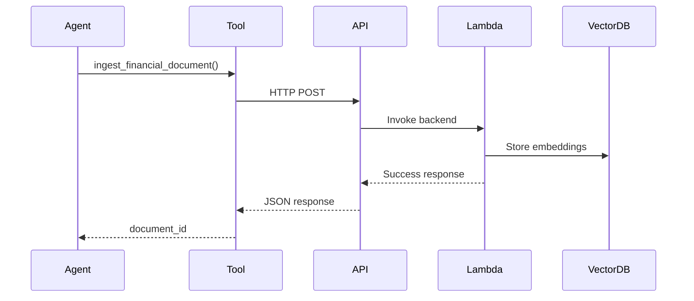
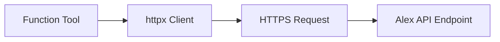
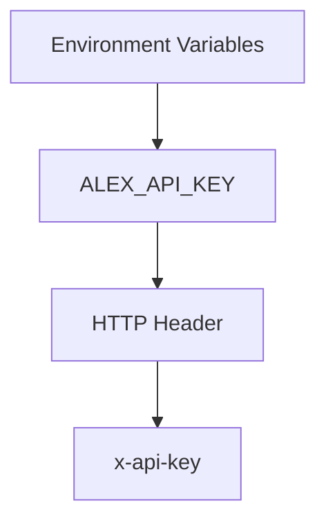
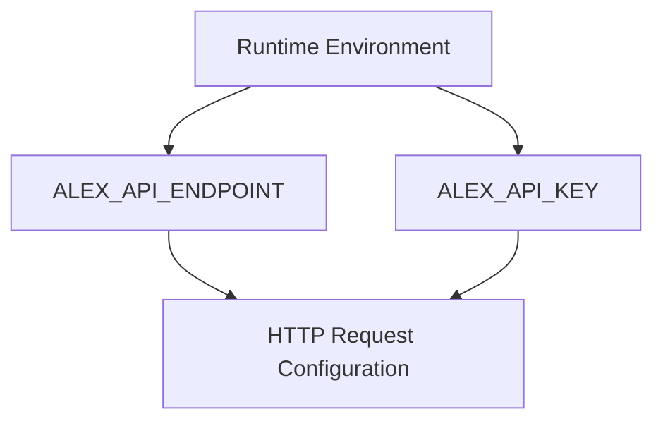
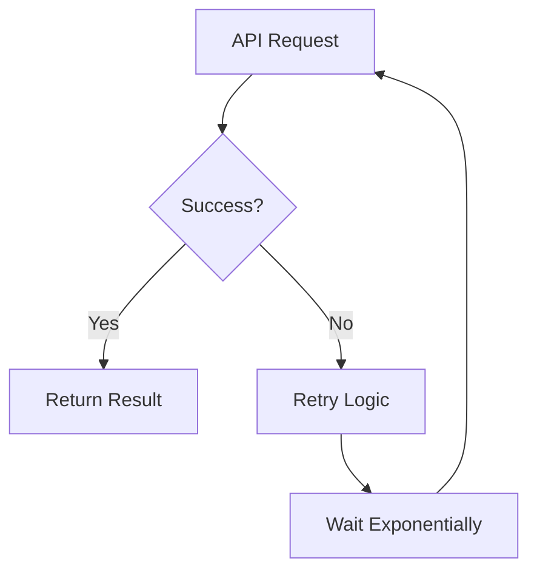
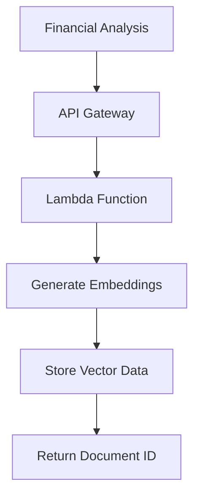
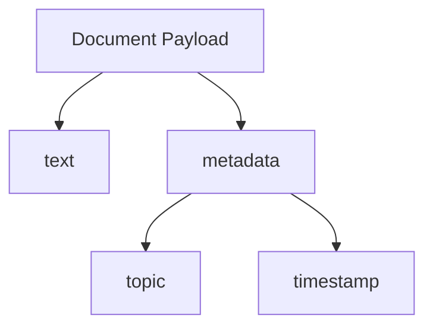
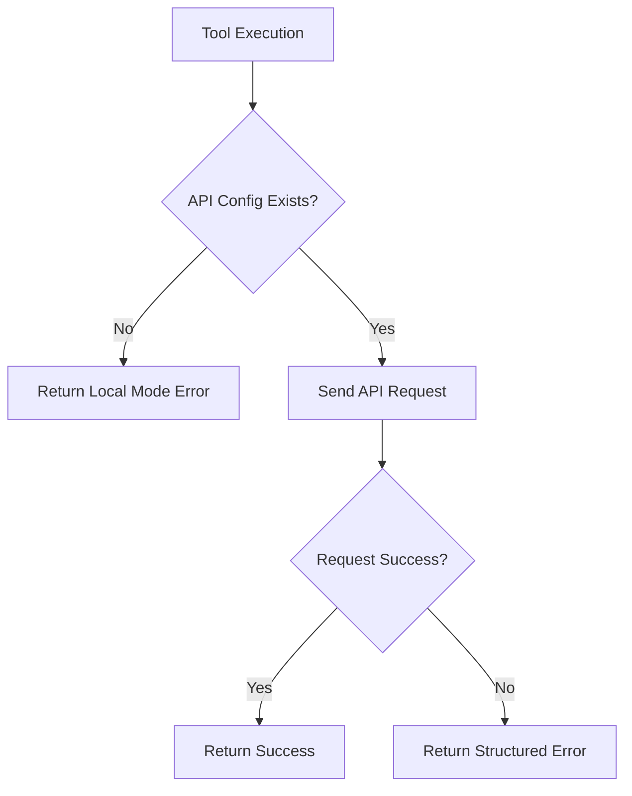
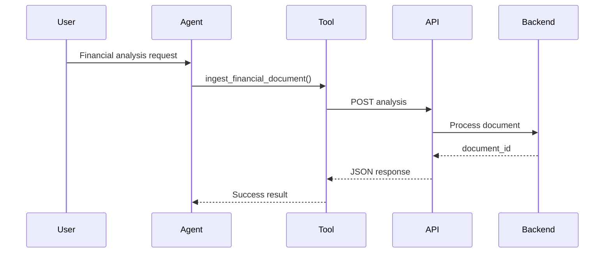

# OpenAI Agents SDK - Tool Calling Architecture

This module exposes an AI agent tool that ingests financial analysis documents into the Alex knowledge base through an external API.

The tool performs:

* document creation
* API communication
* retry handling
* metadata enrichment
* error handling

---

# High-Level Architecture



---

# Main Components

| Component        | Responsibility                 |
| ---------------- | ------------------------------ |
| AI Agent         | Generates financial analysis   |
| `@function_tool` | Exposes callable tool to agent |
| `httpx.Client`   | Sends HTTP requests            |
| API Gateway      | Public ingestion endpoint      |
| Lambda           | Backend processing             |
| SageMaker        | Generates embeddings           |
| Vector Storage   | Stores searchable vectors      |

---

# Tool Registration Design

The decorator:

```python id="jlwmqq"
@function_tool
```

registers the Python function as a callable AI agent tool.

This allows the agent to dynamically invoke it during reasoning.

---

# Tool Invocation Flow



---

# API Communication Architecture

The system uses synchronous HTTP communication through `httpx`.



---

# Authentication Design

Authentication is handled using API keys stored in environment variables.



This avoids hardcoding secrets inside source code.

---

# Environment Configuration Design

The module reads configuration dynamically from environment variables.



Benefits:

* portable deployments
* secret isolation
* environment-specific configuration
* container compatibility

---

# Retry Architecture

The system includes retry handling using exponential backoff.

Purpose:

* handle SageMaker cold starts
* transient network failures
* temporary infrastructure latency

---

# Retry Flow



---

# Exponential Backoff Strategy

Configuration:

```python id="jlwm11"
stop_after_attempt(3)
wait_exponential(min=1, max=10)
```

Retry timing example:

| Attempt | Wait Time |
| ------- | --------- |
| 1       | 1 second  |
| 2       | 2 seconds |
| 3       | 4 seconds |

This prevents overwhelming backend systems during failures.

---

# Backend Processing Pipeline

The backend ingestion API likely performs:

1. receive financial analysis
2. generate embeddings
3. store vectors
4. return document ID

---

# Backend System Design



---

# Metadata Enrichment Design

Before ingestion, metadata is added:

* topic
* UTC timestamp

This improves:

* searchability
* filtering
* auditing
* retrieval context

---

# Document Structure



---

# Error Handling Design

The system gracefully handles:

* missing configuration
* HTTP failures
* backend exceptions
* timeout issues

Instead of crashing, structured error responses are returned.

---

# Error Flow



---

# End-to-End Lifecycle


